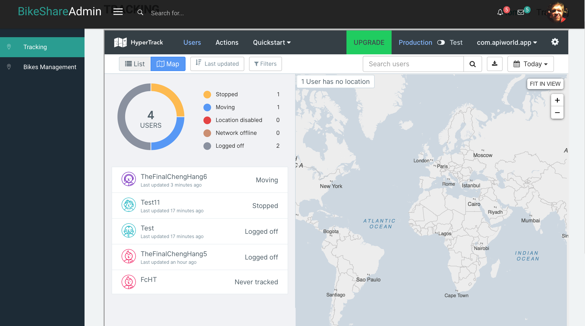

# BikeShare Angular admin panel
Empowered by [Blur-Admin](http://akveo.com/blur-admin-mint/)

## Quickstart 
`gulp serve` for local serving 
`gulp serve:dist` for deployment 

## Features 
#### Dashboard Tracking:
As a bike owner, you can view all the bikes you rent out powered by HyperTrack's [Visual](https://www.hypertrack.com/blog/2016/04/19/hypertracks-tracking-experience/)

License
-------------
<a href=/LICENSE.txt target="_blank">MIT</a> license.

### From akveo

Enjoy!
We're always happy to hear your feedback.
